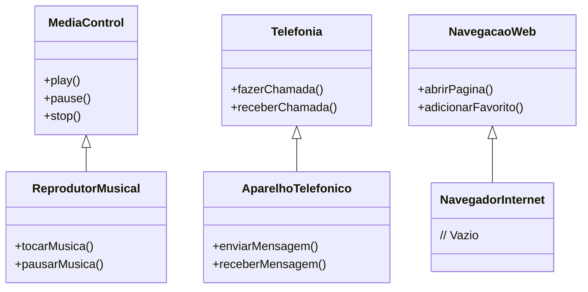

## iPhone 2017 Functionality

### Descrição
Este projeto implementa as funcionalidades básicas de um iPhone, incluindo reprodutor musical, aparelho telefônico e navegador na internet, utilizando Java e conceitos de Programação Orientada a Objetos.

### Estrutura do Projeto
- `com.iphone2017.interfaces`: Contém as interfaces para controle de mídia, telefonia e navegação web.
- `com.iphone2017.implementations`: Contém as implementações das interfaces.
- `com.iphone2017.tests`: Contém a classe principal para testar as funcionalidades.

- 


### Diagrama UML

## Como Executar
1. Clone o repositório:
   ```sh
   git clone https://github.com/teofilonicolau/dio_lancamento_-iPhone_2007.git

- 


