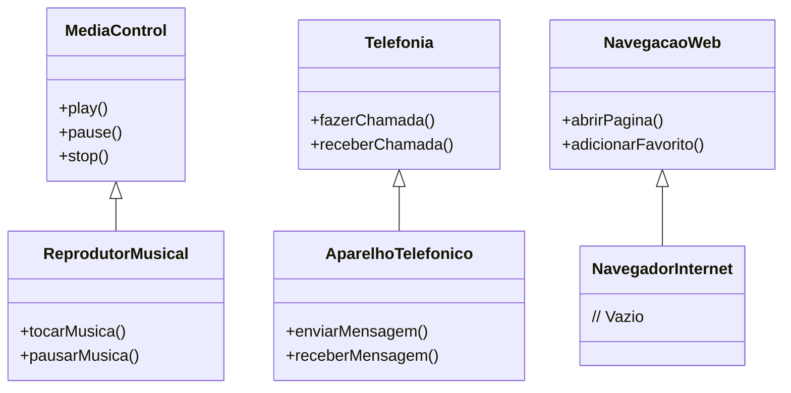

## iPhone 2017 Functionality

### Descrição
Este projeto faz parte do desafio da formação em Java da DIO . Ele implementa as funcionalidades básicas de um iPhone, incluindo reprodutor musical, aparelho telefônico e navegador na internet, utilizando Java e conceitos de Programação Orientada a Objetos.


### Estrutura do Projeto
- `com.iphone2017.interfaces`: Contém as interfaces para controle de mídia, telefonia e navegação web.
- `com.iphone2017.implementations`: Contém as implementações das interfaces.
- `com.iphone2017.tests`: Contém a classe principal para testar as funcionalidades.
- 


### Diagrama UML e Como Executar


## Como Executar
Clone o repositório:
```sh
git clone https://github.com/teofilonicolau/dio_lancamento_-iPhone_2007.git
